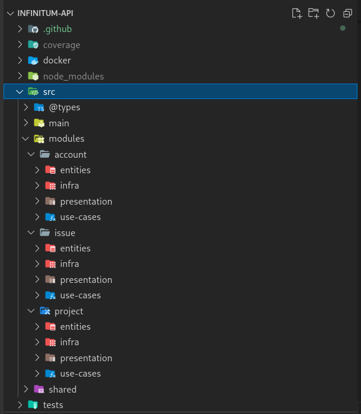

<p align="center">
  
</p>

<h1 align="center">
  Infinitum

</h1>

<p align="center">
  Servidor para site de gerenciamento de projetos e <i>bug tracking</i>
</p>

<br />

<p align="center">
  
  

  <br />
  <br />

  <a target="_blank" href="https://insomnia.rest/run/?label=Infinitum%20API&uri=https%3A%2F%2Fgithub.com%2Fviniciusrodrigues1a%2Finfinitum-api%2Fblob%2Fmain%2FInsomnia_Collection_2022-05-23.json">
    
  </a>
</p>

## :page_facing_up: Índice

- [Sobre o projeto](#about)
- [Tecnologias e ferramentas](#built-using)
- [Informações de contato](#contact)
- [Artigo](#article)
- [Rodando localmente](#running-locally)
- [Rodando testes](#running-tests)
- [Arquitetura](#architecture)

<br />

## :monocle_face: Sobre o projeto <a name="about"></a>

Trabalho de Conclusão de Curso apresentado à Escola Técnica Estadual Elias Nechar, como parte dos requisitos para a obtenção do título de Técnico em Desenvolvimento de Sistemas.

<br />

## :hammer: Tecnologias e ferramentas <a name="built-using"></a>

<p align="left">
  <a href="https://nodejs.org" target="_blank" rel="noreferrer">  </a>
  <a href="https://www.typescriptlang.org/" target="_blank" rel="noreferrer">  </a>
  <a href="https://www.postgresql.org" target="_blank" rel="noreferrer">  </a>
  <a href="https://www.mongodb.com/" target="_blank" rel="noreferrer">  </a>
  <a href="https://redis.io" target="_blank" rel="noreferrer">  </a>
  <a href="https://jestjs.io" target="_blank" rel="noreferrer">  </a>
  <a href="https://www.docker.com/" target="_blank" rel="noreferrer">  </a>
</p>

Desenvolvido utilizando **NodeJS** e **TypeScript**.

Tecnologias de destaque:

- :test_tube: Testes de unidade e de integração com biblioteca Jest
- :key: Autenticação JWT com biblioteca jsonwebtoken
- :package: Fila de processamento de e-mails com biblioteca Bull e banco de dados Redis
- :incoming_envelope: Envio de e-mails com biblioteca Nodemailer
- :bookmark_tabs: Banco de dados MongoDB para armazenamento de notificações
- :left_right_arrow: Estabelecendo conexão bidirecional com Socket.IO para atualizar informações em tempo real
- :whale2: Conteinerização com Docker para isolar processos
- :ship: Orquestração de contêineres com Docker Compose

<br />

## :mailbox: Informações de contato <a name="contact"></a>

Sinta-se livre para me contatar através de uma das plataformas abaixo

<a href="mailto:viniciusrodrigues.aro@gmail.com">
  
</a>

<br />
<br />

## :page_with_curl: Artigo <a name="article"></a>

Faça o download do artigo [aqui](.github/readme-assets/artigo.pdf)

<br />

## :computer: Rodando localmente <a name="running-locally"></a>

Clone o repositório

```bash
  git clone https://github.com/viniciusrodrigues1a/infinitum-api
```

Vá ao diretório do projeto

```bash
  cd infinitum-api
```

Renomeie o arquivo .env.example para .env e adicione as variáveis de ambiente

```bash
  cp .env.example .env
  nano .env
```

Instale as dependências

```bash
  yarn install
```

Inicie os contêineres do docker

```bash
  docker-compose up --detach --build
```

O servidor deve iniciar na porta definida pela variável _PORT_ no arquivo .env

<br />

## :test_tube: Rodando testes <a name="running-tests"></a>

Para rodar os testes de unidade, rode o seguinte comando

```bash
  yarn test:unit
```

Para rodar os testes de integração, rode o seguinte comando

```bash
  yarn test:integration
```

<br />

## :building_construction: Arquitetura <a name="architecture"></a>

O projeto segue a arquitetura [Clean Architecture](https://blog.cleancoder.com/uncle-bob/2012/08/13/the-clean-architecture.html), separado em três módulos (usuários, projetos e issues).

<p align="center">
  
  <br />
  <em>Estrutura de pastas do projeto mostrando os diferentes módulos e suas camadas, conforme a Clean Architecture.</em>
</p>

